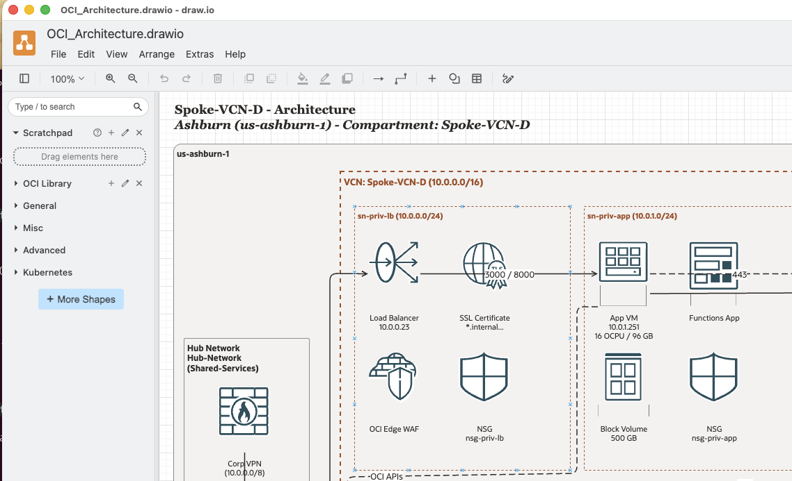
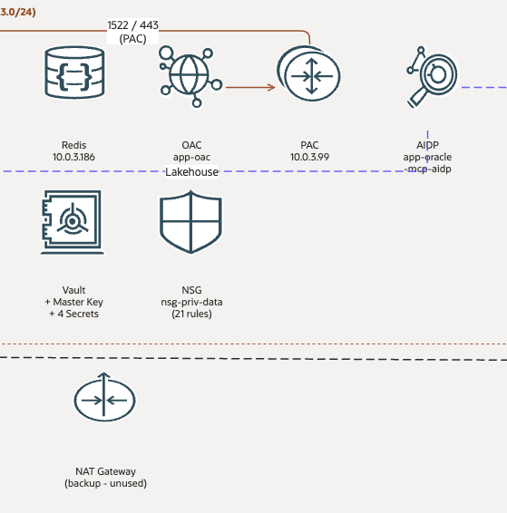

# OCI draw.io Architect — Claude Code Plugin

**A Claude Code plugin that generates production-quality draw.io architecture diagrams for Oracle Cloud Infrastructure (OCI) — from Terraform configurations or free-form descriptions.**

[](https://github.com/sergio-farfan/OCI-draw.io-Architect/releases/tag/v1.0.0)
[](https://www.python.org/)
[](LICENSE)
[]()
[](https://claude.ai/code)

---

**Author:** Sergio Farfan · sergio.farfan@gmail.com
**Version:** 1.0.0 · [Download archive (424KB)](https://github.com/sergio-farfan/OCI-draw.io-Architect/releases/download/v1.0.0/oci-drawio-architect-v1.0.0.tar.gz)

---

## The Problem

If you've ever had to document an OCI architecture, you know the drill. You open draw.io, hunt for the right Oracle icon set, drag shapes onto the canvas, manually wire up VCNs and subnets, nudge elements into alignment, then spend another 30 minutes making sure the colors match Oracle's official template — only to realize the Terraform config changed last week and the diagram is already out of date.

For cloud architects working with OCI, this is a recurring tax on every project:

- **Diagrams drift from reality.** Terraform is the source of truth, but draw.io doesn't know that. Every infrastructure change means a manual diagram update that usually doesn't happen until someone asks for it in a review.
- **The OCI icon set is not built into draw.io.** You have to find it, import it, and figure out which icon maps to which service — across 15 categories and 220+ icons.
- **Layout is time-consuming.** Getting the Region > VCN > Subnet > Service hierarchy right, with proper spacing, no overlapping containers, and Oracle's color scheme, takes significant effort even for experienced users.
- **Hub-and-spoke topologies are especially painful.** When you have 10–15 spoke VCNs connected through a DRG, laying that out cleanly by hand is an hour-long exercise in pixel arithmetic.
- **Diagrams are created once and abandoned.** Because updating them is expensive, teams stop maintaining them. By the time a new engineer joins or an audit happens, the diagram shows an architecture from two sprints ago.

> **The root cause:** architecture diagrams are treated as a design artifact — something you create manually — rather than something you generate from the actual infrastructure definition.

---

## What It Does

Type `/drawio-architect` in any Claude Code session and the plugin generates a production-quality `.drawio` file directly from your infrastructure — no manual drawing, no icon hunting, no layout math.



*Single-VCN topology with Hub Network, subnets, OCI service icons, and Oracle color palette — generated automatically from Terraform.*



*Detail view: data subnet with Redis, OAC, PAC, AIDP, Vault, NSG, and gateway icons, each correctly placed and labeled.*

---

## How It Works

The plugin accepts three input types: a Terraform directory path — parsed to extract VCNs, subnets, gateways, and DRG attachments — a VCN name resolved against existing `.tfvars` files, or a plain-text description of the target architecture. From any of these inputs, it computes a pixel-precise grid layout, calculating container bounding boxes to eliminate element overlap, and generates a Python script leveraging a custom `DrawioBuilder` class backed by 220 bundled OCI SVG icons. Executing the script produces a `.drawio` file fully styled with Oracle's official color palette. The entire workflow runs inside Claude Code via a single `/drawio-architect` command.

### 7-step workflow

1. **Auto-detects project settings** on first run — tenancy name, region, logos — from Terraform configs and OCI CLI, saved to `.claude/oci-drawio-architect.local.md`
2. **Asks what to diagram** — Terraform directory path, VCN name, or free-form description
3. **Reads Terraform configs** to extract VCNs, subnets, services, DRG topology
4. **Plans the layout** with container hierarchy and grid calculations
5. **Generates a Python script** using the bundled `DrawioBuilder` class
6. **Runs the script** to produce the `.drawio` file
7. **Reports results** with file path, size, and viewing instructions

### Diagram types

| Type | Best For | Typical Page Size |
|------|----------|-------------------|
| Single-VCN Topology | Application stacks | 1600 x 1100 |
| Hub-and-Spoke Network | Network overview with DRG | 2400 x 1400 |
| Service Inventory | Compartment-level resource view | 1800 x 1200 |
| Multi-VCN Overview | VCN interconnections via DRG | 2400 x 1600 |

---

## Prerequisites

- **Claude Code** (CLI) installed and working
- **Python 3.8+**
- **draw.io desktop** for viewing generated `.drawio` files

The plugin bundles 220 OCI SVG icons and auto-installs Pillow (Python imaging library) if missing.

---

## Installation

### One-line install

```bash
curl -fsSL https://github.com/sergio-farfan/OCI-draw.io-Architect/releases/download/v1.0.0/oci-drawio-architect-v1.0.0.tar.gz | tar -xz && ./oci-drawio-architect/install.sh
```

This will:
- Download and extract the archive
- Check prerequisites (Python 3, Pillow)
- Install Pillow automatically if missing
- Create a local marketplace at `~/.claude/plugins/marketplaces/local/`
- Copy the plugin files into the marketplace
- Verify all components (5 checks)

### Register in Claude Code

Open Claude Code and run these two commands:

```
/plugin marketplace add ~/.claude/plugins/marketplaces/local
/plugin install oci-drawio-architect@local
```

### Restart Claude Code

Exit and reopen Claude Code for the plugin to load.

### Verify

```
/drawio-architect
```

The command will prompt you for what to diagram.

---

## Auto-detected Settings

On first run, the plugin detects and saves these settings:

| Setting | Source | Description |
|---------|--------|-------------|
| `tenancy_name` | OCI CLI | Tenancy display name (for diagram title) |
| `region` | Terraform `provider.tf` | OCI region identifier |
| `region_label` | Auto-derived | Human-readable region name (e.g., "Ashburn") |
| `oci_profile` | Terraform `provider.tf` | OCI CLI profile name |
| `logo_light` | File scan | Logo for light backgrounds |
| `logo_dark` | File scan | Logo for dark backgrounds |
| `compartment` | Manual | Set this yourself for diagram scope |

Settings are stored in `.claude/oci-drawio-architect.local.md` (per-project, gitignored). Edit the file directly to change values. Delete the file and re-run `/drawio-architect` to re-detect.

### Skill auto-activation

The plugin also activates automatically when you mention in conversation:
- "draw.io OCI"
- "diagram this architecture"
- "drawio with OCI icons"

---

## Uninstall

```bash
~/.claude/plugins/marketplaces/local/plugins/oci-drawio-architect/install.sh --uninstall
```

Then inside Claude Code:

```
/plugin uninstall oci-drawio-architect@local
```

Restart Claude Code.

---

## Troubleshooting

| Problem | Fix |
|---------|-----|
| `/drawio-architect` not found | Restart Claude Code after plugin install |
| `ModuleNotFoundError: PIL` | Run `pip install Pillow` |
| Icons appear blank in diagram | Plugin bundles icons — check `icons/` dir has SVG files |
| Settings not detected | Ensure `provider.tf` exists in your Terraform directory |
| Want to re-detect settings | Delete `.claude/oci-drawio-architect.local.md` and re-run |
| Tenancy name missing | Install and configure OCI CLI (`brew install oci-cli`) |
