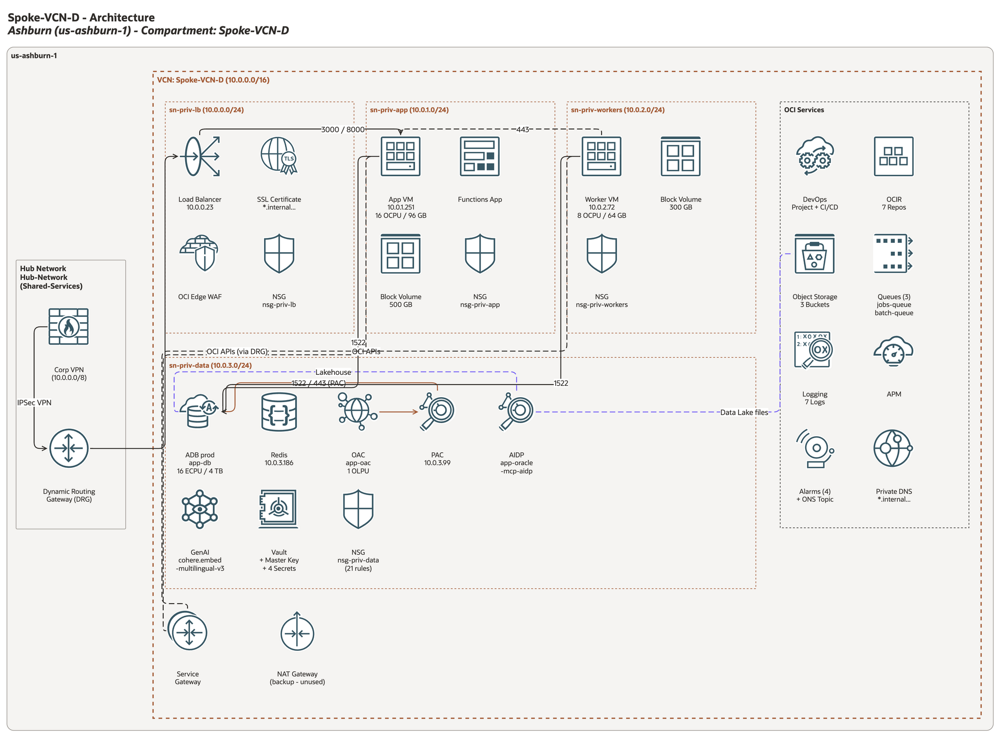
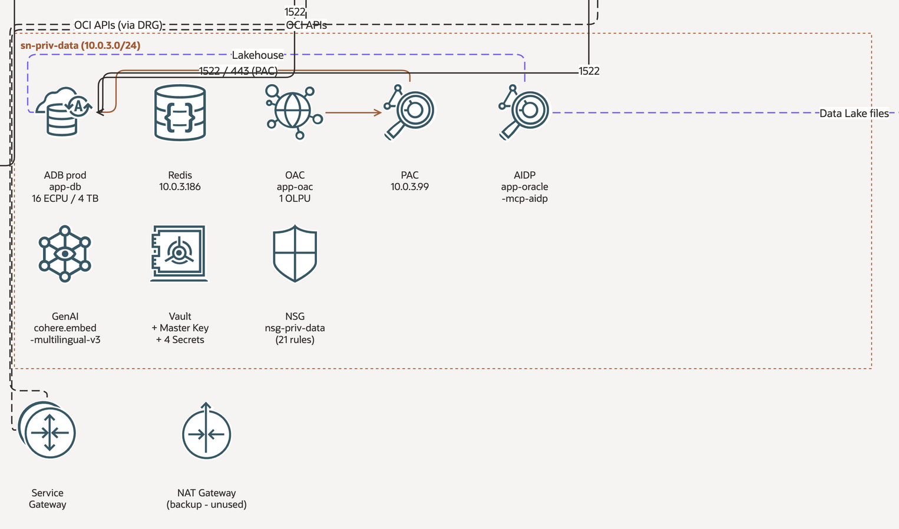

# OCI draw.io Architect — Claude Code Plugin

**A Claude Code plugin that generates production-quality draw.io architecture diagrams for Oracle Cloud Infrastructure (OCI) — from Terraform configurations or free-form descriptions.**

[](https://github.com/sergio-farfan/OCI-draw.io-Architect/releases/tag/v1.3.0)
[](https://www.python.org/)
[](LICENSE)
[]()
[](https://claude.ai/code)

---

**Author:** Sergio Farfan · sergio.farfan@gmail.com
**Version:** 1.3.0 · [Download archive](https://github.com/sergio-farfan/OCI-draw.io-Architect/releases/download/v1.3.0/oci-drawio-architect-v1.3.0.tar.gz) · [Changelog](oci-drawio-architect/CHANGELOG.md)

---

## The Problem

If you've ever had to document an OCI architecture, you know the drill. You open draw.io, hunt for the right Oracle icon set, drag shapes onto the canvas, manually wire up VCNs and subnets, nudge elements into alignment, then spend another 30 minutes making sure the colors match Oracle's official template — only to realize the Terraform config changed last week and the diagram is already out of date.

For cloud architects working with OCI, this is a recurring tax on every project:

- **Diagrams drift from reality.** Terraform is the source of truth, but draw.io doesn't know that. Every infrastructure change means a manual diagram update that usually doesn't happen until someone asks for it in a review.
- **The OCI icon set is not built into draw.io.** You have to find it, import it, and figure out which icon maps to which service — across a dozen categories and more than 150 icons.
- **Layout is time-consuming.** Getting the Region > VCN > Subnet > Service hierarchy right, with proper spacing, no overlapping containers, and Oracle's color scheme, takes significant effort even for experienced users.
- **Hub-and-spoke topologies are especially painful.** When you have 10–15 spoke VCNs connected through a DRG, laying that out cleanly by hand is an hour-long exercise in pixel arithmetic.
- **Diagrams are created once and abandoned.** Because updating them is expensive, teams stop maintaining them. By the time a new engineer joins or an audit happens, the diagram shows an architecture from two sprints ago.

> **The root cause:** architecture diagrams are treated as a design artifact — something you create manually — rather than something you generate from the actual infrastructure definition.

---

## What It Does

Type `/drawio-architect` in any Claude Code session and the plugin generates a production-quality `.drawio` file directly from your infrastructure — no manual drawing, no icon hunting, no layout math.



*Single-VCN topology with the on-premises panel, region-level DRG and its VCN attachment, subnets with NSG shields on the protected resources, gateways on the VCN border and the Oracle Services Network panel — rendered by draw.io from the reference layout example (`oci-drawio-architect/examples/generate_reference_layout.py`); every connector is routed automatically.*



*Detail view: data subnet, NAT gateway on the bottom border and Service Gateway on the right border — uniform icon sizes, captions under every icon, connectors kept in the gutters.*

---

## How It Works

The plugin accepts three input types: a Terraform directory (HCL or `terraform show -json` output) — parsed to extract VCNs, subnets, gateways, and DRG attachments — a VCN name resolved against existing `.tfvars` files, or a plain-text description of the target architecture. Whatever the input, it is first normalized into a small **model** (subject, region, hub, VCNs with subnets and their icons, an OCI Services panel, gateways, edges). A deterministic layout recipe (`scripts/oci_layout.py`) turns that model into a diagram with the same structure as the reference sample: subnets in traffic order, a services panel, a gateway row, a hub panel vertically centred on the VCN. Under the hood, a `DrawioBuilder` class backed by **159 bundled OCI SVG icons** sizes every container from its children, routes every connector through the gutters so it doesn't cross unrelated icons or captions, styles everything with Oracle's Redwood palette, and validates the result (overlaps, containment, dangling ids, label overflow, edge crossings) before the file is written. If draw.io desktop is installed, the plugin also exports a PNG so the result can be inspected visually. The entire workflow runs inside Claude Code via a single `/drawio-architect` command.

### 7-step workflow

1. **Settings** — on first run, auto-detects tenancy, region, VCNs, compartments and logos from Terraform configs, `~/.oci/config` and the OCI CLI, and saves them to `.claude/oci-drawio-architect.local.md`
2. **Input** — asks what to diagram: Terraform directory path, VCN name, or free-form description
3. **Model** — normalizes the input into the diagram model (VCNs, subnets, services with their regional / VCN-resident class, gateways, DRGs with attachments, on-premises side, edges)
4. **Generate** — writes a `generate_<name>_drawio.py` script that imports the plugin's `DrawioBuilder` / `oci_layout` directly from the plugin (`sys.path.insert(0, "<plugin>/scripts")`) — nothing is copied into your project
5. **Run** — executes the script to produce the `.drawio` file
6. **Validate + render** — gates on `scripts/check_overlaps.py` (exit 0 required) and, when draw.io desktop is available, exports a PNG with `scripts/render_drawio.py` for a visual check
7. **Report** — file path, size, what's in the diagram, settings used, and viewing instructions

### Diagram types

All four types share the same model and layout recipe; the page is sized from the content (`fit_page()`), so there is no fixed canvas size to pick.

| Type | Best For | Layout |
|------|----------|--------|
| Single-VCN Topology | Application stacks | Region > optional on-premises panel + DRG column + one VCN column: subnet rows in traffic order, data tier, gateways on the VCN border, Oracle Services Network panel |
| Hub-and-Spoke Network | Network overview with DRG | On-premises panel (CPE), region-level DRG with one attachment box per spoke, spoke VCN columns, OSN panel; attachment connectors without arrowheads |
| Service Inventory | Compartment-level resource view | Compartment and services panels built with `place_icons()` / `fit_to_children()`; NSG or route rules as `add_table()` pages |
| Multi-VCN Overview | VCN interconnections via DRG | Several VCN columns, LPG pairs on facing borders, OSN panel, cross-VCN edges |

---

## What's new in 1.3.0

Topology-aware placement: the layout recipe now follows how the team's diagram guidelines and Oracle's own reference architectures draw connectivity infrastructure (see the [changelog](oci-drawio-architect/CHANGELOG.md) for the complete list):

- **The DRG is a region-level element.** It sits between the on-premises panel and the VCN columns with one rounded attachment box per attachment beside it (VCN, IPSec, FastConnect, remote peering); `drg_style` `icon` (default) or `box` groups the boxes under a dashed `DRG: <name>` frame.
- **Gateways sit on the VCN border**, not in a bottom row: IGW and NAT straddle the bottom, the Service Gateway the right border facing the services panel, LPGs the border facing their peer VCN.
- **Regional services get their own Oracle Services Network panel**, right of the VCN columns, fed by the Service Gateway; VCN-resident services without a subnet stay in the VCN.
- **Four connector kinds and a legend**: `data` (solid, open arrow), `control` (dashed, open arrow), `association` (dotted, no arrowhead) and `attachment` (thin solid, no arrowhead), plus `add_legend()` rows for all four.
- **New validator rules** catch a DRG box parented inside a VCN and any leaf sitting inside a VCN/subnet it does not belong to, with tolerances so border-straddling gateways still pass.
- **Model schema 2** (`drgs[]` with typed attachments, `services[].regional`, `gateways[].peer`) with automatic migration and a warning for schema-1 models.
- **Route tables, security lists and NSGs are badges, not icons.** `subnet.route_table` / `subnet.security_lists` draw half-size badges on the subnet's top-right corner and `item.nsgs` a shield on the protected resource's icon (names in the tooltip); `parse_terraform.py` and `query_tenancy.py` fill the fields from the Terraform and topology attributes. The reference sample (`OCI_Architecture.drawio`) and the screenshots above show the four NSGs as shields on the load balancer, the two VMs and the database; hand-placed `nsg` icons stay valid in existing scripts.

## What was new in 1.2.0

Driven by a full code review and output-quality audit of 1.1.0 (see the [changelog](oci-drawio-architect/CHANGELOG.md) for the complete list):

- **The workflow works out of the box.** Generated scripts import the builder from the plugin directory instead of copying `drawio_builder.py` into your project; icons resolve through `$OCI_SVG_DIR`, the plugin's `icons/`, `$CLAUDE_PLUGIN_ROOT/icons` and the standard `~/.claude/plugins` install locations.
- **The reference look is back.** Region / on-premises / compartment labels top-left at 12px, charcoal 1px dashed services panel, dashed edges with `dashPattern=6 3`, and a font stack (`Oracle Sans,Arial,Helvetica,sans-serif`) so labels never fall back to a serif face. Three style profiles: `default`, `official` (strict OCI toolkit v24.2) and `v1.0`. New container types `other`, `metro_or_realm`, `third_party_cloud`, `internet`.
- **Icons render at one size, without ghost boxes.** 16 icons (VM, Functions, Block Volume, Buckets, Object Storage and others) carried a leftover caption-placeholder rectangle; it is gone, every viewBox is cropped to the glyph, and every glyph is fitted into a uniform 70×70 area of a 75×95 slot. 55 empty stencil shells were removed and 4 scrape-artifact filenames fixed (159 icons in 12 categories remain, every one addressable by file stem plus 206 short aliases).
- **Edges route themselves.** `add_edge()` picks the common-ancestor parent and routes through container margins and gutters, avoiding icons, captions and container titles; labels dodge collisions. `route="direct"` and `route="pinned"` keep the 1.1.0 and 1.0.0 behaviours.
- **Validation catches what used to slip through.** Any-two-container overlaps, child containers spilling out of their parent, icon/caption collisions, unknown `parent`/`source`/`target` ids (which made draw.io silently drop the whole diagram), long captions and estimated edge crossings — with compressed pages and `UserObject` wrappers handled.
- **Layout helpers** so nobody hand-computes coordinates: `place_icons`, `fit_to_children`, `resize`, `fit_page`, `add_title`, `add_legend`, `add_table`, `add_page` / `use_page` / `add_layer`, deterministic ids via `key=`, `metadata` / `tooltip` / `link`, `render()`.
- **New tools:** `oci_layout.py` (model → diagram CLI), `render_drawio.py` (PNG/SVG/PDF export), `build_icon_catalog.py`, `smoke_test.sh`, `parse_terraform.py` (Terraform HCL directory, `--plan-json` or `--state-json` → model, with `--vcn` filtering) and the experimental `query_tenancy.py` (live tenancy → model via the OCI CLI); `examples/generate_reference_layout.py` rebuilds the reference sample from a model dict; a `tests/` suite covering the builder, settings detection and the icon set.
- **Settings detection rewritten:** `region = var.region` resolved through tfvars and variable defaults, comment stripping, provider-block scoping, complete region table (`eu-london-1` was never a region — `uk-london-1` is), `[DEFAULT]` inheritance in `~/.oci/config`, CLI timeouts and session-token auth, logo classification fixed, relative logo paths, new keys `vcns`, `compartments`, `terraform_dirs`, `auth_tenancy_ocid`, `oci_auth`, `subscribed_regions`, `home_region`.
- **Installer and packager hardened:** `python3 -m pip --user`, Pillow optional (warns, never blocks), `rsync` with `cp` fallback, JSON-based upsert of `marketplace.json` that preserves other plugins, 8 verification checks including a post-install smoke test, cleaner uninstall; `pack.sh` is reproducible, excludes `logos/` and tarballs, always includes `LICENSE` and `icons/NOTICE`, and prints the SHA256.

---

## Prerequisites

- **Claude Code** (CLI) installed and working
- **Python 3.9+** — the builder uses only the standard library
- **draw.io desktop** for viewing generated `.drawio` files (and for the optional PNG export)
- **Pillow** (optional) — needed only to embed PNG/JPEG logos with `add_image()`; SVG logos and all bundled icons work without it
- **OCI CLI** (optional) — for tenancy name and region subscriptions during settings auto-detection

The plugin bundles 159 OCI SVG icons (12 categories, about 1.4 MB); no external icon dependency is needed.

---

## Installation

### One-line install

```bash
curl -fsSL https://github.com/sergio-farfan/OCI-draw.io-Architect/releases/download/v1.3.0/oci-drawio-architect-v1.3.0.tar.gz | tar -xz && ./oci-drawio-architect/install.sh
```

This will:
- Download and extract the archive
- Check prerequisites (Claude Code directory, Python 3.9+, `rsync` or `cp`)
- Try `python3 -m pip install --user Pillow` if Pillow is missing — and continue without it if that fails
- Create or update the local marketplace at `~/.claude/plugins/marketplaces/local/` (only the `oci-drawio-architect` entry in `marketplace.json` is touched)
- Copy the plugin files into the marketplace (staged, then swapped in atomically)
- Verify all components (8 checks, including a post-install smoke test that generates the demo diagram and runs the overlap checker on it)

### Register in Claude Code

Open Claude Code and run these two commands:

```
/plugin marketplace add ~/.claude/plugins/marketplaces/local
/plugin install oci-drawio-architect@local
```

### Restart Claude Code

Exit and reopen Claude Code for the plugin to load.

### Verify

```
/drawio-architect
```

The command will prompt you for what to diagram.

---

## Auto-detected Settings

On first run, the plugin probes your Terraform files, `~/.oci/config` and the OCI CLI (each CLI call is bounded by an 8 s timeout) and saves what it finds:

| Setting | Source | Description |
|---------|--------|-------------|
| `tenancy_name` | OCI CLI (`oci iam tenancy get`) | Tenancy display name (for the diagram title) |
| `tenancy_ocid` | Terraform provider block / tfvars, `~/.oci/config` | Tenancy OCID (must match `ocid1.tenancy.`) |
| `auth_tenancy_ocid` | `~/.oci/config` | Reported when the CLI identity's tenancy differs from the Terraform one |
| `region` | Terraform `provider "oci"` block (`var.region` resolved via tfvars / variable defaults), then `~/.oci/config` | OCI region identifier |
| `region_label` | Auto-derived | Human-readable region name (55-entry table; a label is derived for unknown regions) |
| `home_region`, `subscribed_regions` | OCI CLI (`oci iam region-subscription list`) | Tenancy's home region and subscriptions |
| `oci_profile`, `oci_auth` | Terraform provider block, `~/.oci/config` | CLI profile; `security_token` when session auth is configured |
| `compartment`, `compartment_ocid`, `compartments` | Terraform (`oci_identity_compartment` resources, `compartment_ocid` / `compartment_id` variables) | Diagram scope — edit `compartment` by hand if needed |
| `vcns` | Terraform (`oci_core_vcn` resources or `vcns = {...}` tfvars maps) | VCN names and CIDRs |
| `logo_light`, `logo_dark` | File scan (`logos/`, `assets/logos/`, `assets/images/`, `docs/logos/`, then the plugin-local `logos/`) | `*dark*` / `*black*` files become `logo_light` (dark artwork for light backgrounds); `*white*` / `*light*` become `logo_dark`. Project paths are stored relative |
| `terraform_dir`, `terraform_dirs` | Directory walk (shallowest dir with a `provider "oci"` block, else with tfvars; `.terraform`, `.git`, `node_modules` pruned) | Chosen directory plus any tied candidates |

Settings are stored in `.claude/oci-drawio-architect.local.md` (per-project; ignored via `.claude/*.local.md` in `.gitignore`). Edit the file directly to change values. Delete the file and re-run `/drawio-architect` to re-detect, or run the probe yourself:

```bash
python3 ~/.claude/plugins/marketplaces/local/plugins/oci-drawio-architect/scripts/detect_settings.py [--no-cli] [terraform_dir]
```

### Skill auto-activation

The plugin also activates automatically when you mention in conversation:
- "draw.io OCI"
- "diagram this architecture"
- "drawio with OCI icons"

---

## Uninstall

```bash
~/.claude/plugins/marketplaces/local/plugins/oci-drawio-architect/install.sh --uninstall
```

This removes the plugin files, its cache, its `installed_plugins.json` entry and its `marketplace.json` entry (other plugins are preserved); the local marketplace itself is removed only when nothing else lives in it.

Then inside Claude Code:

```
/plugin uninstall oci-drawio-architect@local
```

(and `/plugin marketplace remove local` if the installer reported the marketplace is now empty). Restart Claude Code.

---

## Development

Everything runs from the source tree; no install is needed.

```bash
# Unit tests (builder, settings-detection fixtures, icon-set integrity and alias map)
python3 -m unittest discover -s oci-drawio-architect/tests

# End-to-end smoke test: demo diagram -> overlap checker -> PNG (if draw.io desktop is present)
oci-drawio-architect/scripts/smoke_test.sh            # SMOKE_SKIP_PNG=1 to skip the export

# Rebuild the reference sample from its model dict, then validate and render it
python3 oci-drawio-architect/examples/generate_reference_layout.py out.drawio --render
python3 oci-drawio-architect/scripts/check_overlaps.py --strict out.drawio     # exit 0 clean, 1 errors, 2 unusable input
python3 oci-drawio-architect/scripts/render_drawio.py out.drawio -f png        # exit 3 when draw.io desktop is missing (DRAWIO_BIN overrides)

# Terraform -> model JSON -> diagram with the shared recipe
python3 oci-drawio-architect/scripts/parse_terraform.py terraform/envs/prod --vcn app-vcn --out model.json   # or --plan-json / --state-json
python3 oci-drawio-architect/scripts/oci_layout.py model.json -o out.drawio --profile default --legend --render png

# Regenerate / verify the icon catalog after touching icons/
python3 oci-drawio-architect/scripts/build_icon_catalog.py --check

# Regenerate the README screenshots from the reference example (needs draw.io desktop)
python3 oci-drawio-architect/examples/make_screenshots.py

# Package a release (version is read from .claude-plugin/plugin.json; prints size, entry count and SHA256)
oci-drawio-architect/pack.sh /path/to/output
```

Expect generated `.drawio` files to weigh roughly 7–13 KB per embedded icon (the three-page demo with 26 icons is about 300 KB; the reference sample with 27 icons and 4 badges about 280 KB). The reference sample itself is `OCI_Architecture.drawio` at the repository root.

---

## Icon licensing

The plugin code is MIT-licensed (see [LICENSE](LICENSE)). The SVG files under `oci-drawio-architect/icons/` are **Oracle Cloud Infrastructure architecture icons** — Copyright (c) Oracle and/or its affiliates — sourced from the [OCI Architecture Diagram Toolkit](https://docs.oracle.com/en-us/iaas/Content/General/Reference/graphicsfordiagrams.htm). They are **not** covered by the MIT license; they are bundled solely so the plugin can embed them when documenting OCI architectures. See [`oci-drawio-architect/icons/NOTICE`](oci-drawio-architect/icons/NOTICE) for the attribution and refer to Oracle's page for the applicable terms before using the icons for any other purpose.

---

## Troubleshooting

| Problem | Fix |
|---------|-----|
| `/drawio-architect` not found | Restart Claude Code after plugin install |
| `Pillow is required for PNG/JPEG logos` | `python3 -m pip install --user Pillow` (add `--break-system-packages` on PEP 668 Pythons, or use a venv). Only PNG/JPEG logos need it; use an SVG logo to avoid the dependency |
| `OCI icon directory not found` / `Icon SVG not found` | The builder searches `$OCI_SVG_DIR`, the plugin's `icons/`, `$CLAUDE_PLUGIN_ROOT/icons` and `~/.claude/plugins/...`. Export `OCI_SVG_DIR=/path/to/oci-drawio-architect/icons` or call `set_icon_dir()` |
| Unknown icon key | The error lists close matches; every SVG is usable by its file stem (`compute_virtual_machine_vm`) or alias (`vm`) — see `references/icon-catalog.md` |
| `check_overlaps.py` exits 1 | Read the `ERROR:` / `OVERLAP:` lines: fix the container sizes (`fit_to_children()`), the parent ids, or the layout math, regenerate and re-run |
| `render_drawio.py` exits 3 | draw.io desktop not found on PATH, `/Applications`, `/opt` or snap — install it or set `DRAWIO_BIN=/path/to/drawio` |
| Settings not detected | Ensure a `provider "oci" {}` block exists in your Terraform directory (or pass the directory to `detect_settings.py`) |
| Want to re-detect settings | Delete `.claude/oci-drawio-architect.local.md` and re-run |
| Tenancy name missing | Install and configure OCI CLI (`brew install oci-cli`); `--no-cli` skips the queries entirely |
| Fonts look wrong in draw.io | Close and reopen the file (draw.io caches renders); labels use the `Oracle Sans,Arial,Helvetica,sans-serif` stack |
